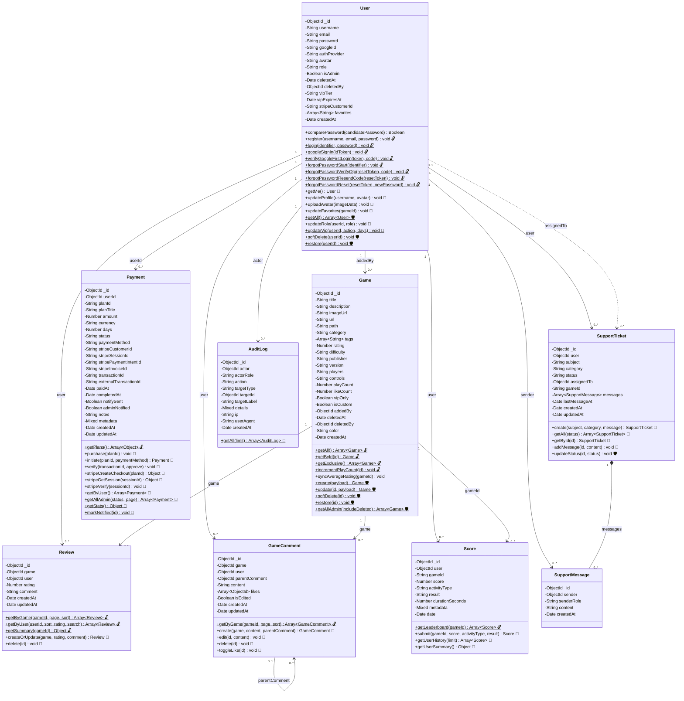

# GameHub — Class Diagram

> **Chú giải quyền truy cập (Access Legend)**
> - 🔓 `public` — Không cần đăng nhập
> - 🔑 `auth` — Yêu cầu đăng nhập (requireAuth)
> - 🛡️ `mod/admin` — Yêu cầu quyền Mod hoặc Admin (requireModOrAdmin)
> - 👑 `admin` — Chỉ Admin (requireAdmin)

